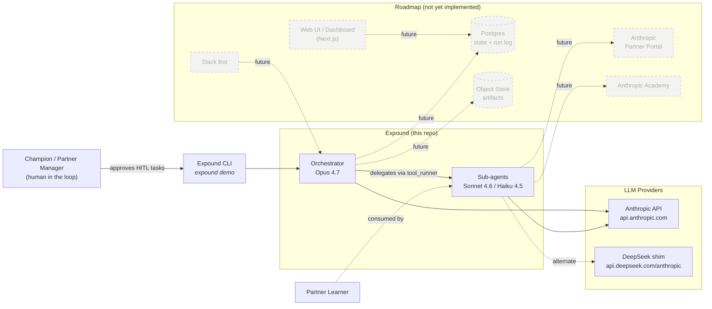
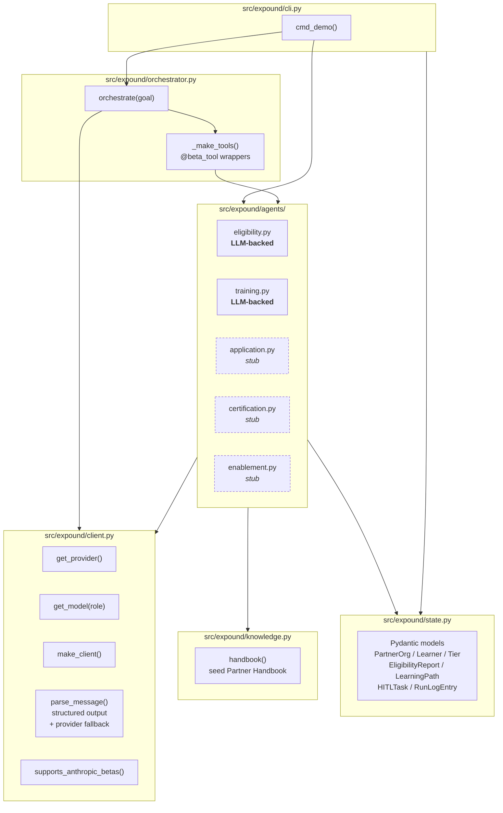
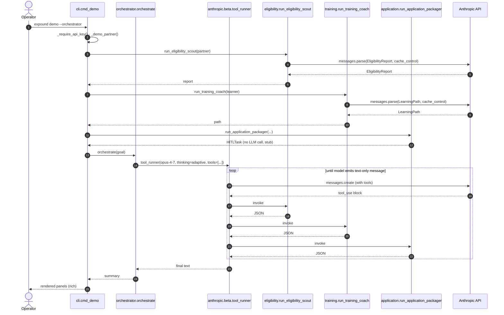
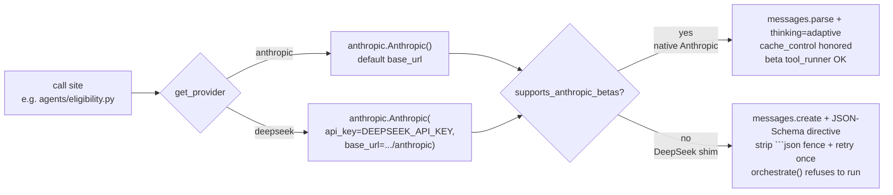
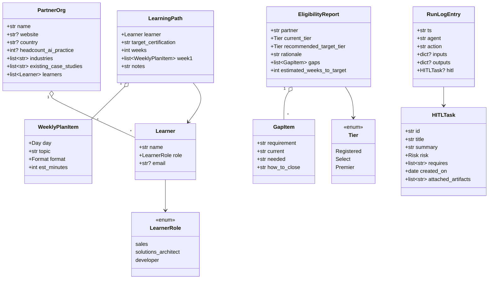
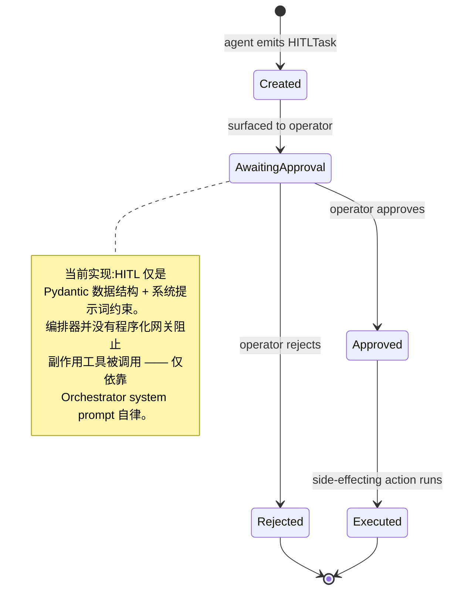
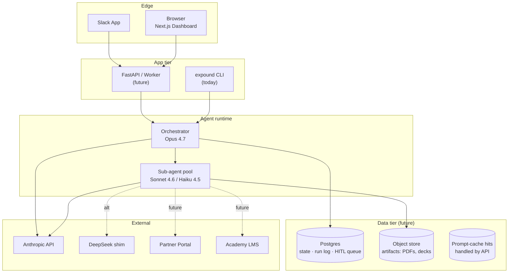

# Expound — 工程化架构 & Code Review

> 对应版本:`claude/upload-files-review-PQWkC` 分支(基于 commit `507782f`)。
>
> 本文做两件事:
> 1. 给出当前代码骨架的 **工程化架构图**(系统视图 / 模块视图 / 时序视图 / 状态视图 / 部署视图)。
> 2. 给出一份 **代码 review**(优点 + 问题 + 建议),按优先级排序。

---

## 1. 架构图

### 1.1 系统上下文(C4 L1)



### 1.2 模块视图(当前代码)



### 1.3 编排时序(`expound demo --orchestrator`)



### 1.4 Provider 路由



### 1.5 数据契约(Pydantic 边界)



### 1.6 HITL 状态机(设计意图 — 暂未代码化)



### 1.7 部署(目标态)



---

## 2. Code Review

按 **影响面 / 修复成本** 排序;每条都标注了具体文件 + 行号方便跳转。

### 2.1 优点(保持)

1. **单一职责切分清晰** — `cli` / `orchestrator` / `agents/*` / `state` / `knowledge` / `client` 没有相互越位,模块边界与设计文档(`docs/partner-journey.md`)对得上。
2. **Pydantic 作为契约** — `state.py` 的 `EligibilityReport` / `LearningPath` / `HITLTask` 既是 LLM 输出 schema,又是审计 / Dashboard 消费层的 DTO。这种"契约即数据模型"的做法是 multi-agent 系统的最佳实践之一。
3. **Provider 抽象层有度** — `client.py:supports_anthropic_betas()` 把"原生 Anthropic 才有的 beta 能力"显式抽出来,而不是散布 `if provider == ...` 在每个 agent 里。`thinking_kwargs()` 的"在不支持时返回空 dict"是个干净的方式。
4. **Prompt caching 已落到位** — `eligibility.py:38-48` 与 `training.py:38-45` 把稳定的 Handbook 内容用 `cache_control={"type": "ephemeral"}` 单独切块,符合 README 里"成本优化"的承诺。
5. **DeepSeek fallback 设计周到** — `client.py:parse_message()` 在没有 `messages.parse` 的情况下,自动注入 JSON-Schema 指令、剥 markdown 围栏、失败一次再带错误信息重试一次。比单纯抛错要鲁棒。
6. **Orchestrator 自身保持极小** — `orchestrator.py` 只放路由 + HITL 守则,domain 知识全在子 agent。这正是 multi-agent 编排的正确耦合方向。
7. **注释写"为什么"** — `client.py:80-88`(为什么需要 `supports_anthropic_betas()`)、`knowledge.py:1-17`(为什么 seed handbook 要做 prompt caching)都解释了非显然的设计取舍,而不是复述代码。

---

### 2.2 高优先级(影响功能正确性)

#### **H1.** `from anthropic import beta_tool` 在 module load 时即触发,会让 DeepSeek-only 用户启动失败 — `orchestrator.py:18`

```python
# orchestrator.py:18
from anthropic import beta_tool
```

`beta_tool` 是 Anthropic SDK 的 beta 装饰器。如果用户装的 SDK 版本没有 export 它(版本低 / 已重命名),`import expound.cli` 会因为 `cli.py` import `orchestrator` 而连锁失败 —— 哪怕 `EXPOUND_PROVIDER=deepseek` 根本不会调用 `orchestrate()`。

`supports_anthropic_betas()` 守卫只在 `orchestrate()` **调用时**才生效,救不了 import-time。

**修复**:把 `beta_tool` import 和 `_make_tools()` 都延迟到 `orchestrate()` 函数体内,或者用 lazy import:

```python
def orchestrate(goal: str, client: anthropic.Anthropic | None = None) -> str:
    if not supports_anthropic_betas():
        raise RuntimeError(...)
    from anthropic import beta_tool  # noqa: import inside guard, by design
    ...
```

#### **H2.** `RunLogEntry` 设计了但**没人写** — `state.py:97-104`

```python
class RunLogEntry(BaseModel):
    """One observable step. Dashboard + audit log consume these."""
```

README 在"设计原则"里承诺"每次 Agent 调用写 run log",但代码里 grep 不到任何写 `RunLogEntry` 的位置。子 agent 无埋点,orchestrator 也没在 tool_runner 循环里收集步骤。**Dashboard 现在没有数据可消费**。

**修复**:在 `client.py` 加一个 thin wrapper(比如 `logged_call(role, action, fn)`),所有 sub-agent 调用走它,产出 `RunLogEntry` 写到 `~/.expound/runs/<run_id>.jsonl`(或注入的 sink)。Orchestrator 在 `for message in runner` 里也要把 `tool_use` 块翻译成 entries。

#### **H3.** Orchestrator 的 HITL 守则**只靠 system prompt 强制**,没有程序化网关 — `orchestrator.py:24-42`

```
- Any action with external side effects ... must be surfaced as a HITL task
  — never executed directly.
```

如果未来加进了**真正会触发副作用**的 tool(发邮件、签 DocuSign、改 CRM),只靠 LLM 服从 system prompt 是远远不够的。

**修复**:加一个 `class HITLGate`,所有"会产生副作用"的工具必须返回 `HITLTask`(类型系统强约束),`HITLGate.execute(task, approver_token)` 才是真正落地的入口;orchestrator 永远拿不到 `execute` 这一面。也就是把"写"和"读"分两个层。

#### **H4.** 子 agent 契约漂移:`certification` / `enablement` 返回 `dict` 而非 Pydantic — `agents/certification.py:11`、`agents/enablement.py:11`

```python
def run_certification_prep(learner_name: str, certification: str) -> dict:
def run_enablement_gtm(partner_name: str, industry: str | None = None) -> dict:
```

README 写"子 Agent 返回 Pydantic 模型,便于编排层聚合与审计",但这两个 stub 没遵守。orchestrator 里这两个工具直接 `json.dumps(...)`,失去了 schema 验证 + 审计契约。即便是 stub,也应该先把契约形状定下来。

**修复**:`state.py` 加上 `CertificationReadiness` / `EnablementBundle` 两个 model,把 stub 切回去返回 model 实例。这样真实实现接管时不会改调用方。

#### **H5.** `target_tier: str` 没用 `Tier` 枚举 — `agents/application.py:15`、`cli.py:89`、`orchestrator.py:79`

```python
def run_application_packager(partner_name: str, target_tier: str) -> HITLTask:
```

而 `state.py` 已经定义了 `class Tier(str, Enum)`。`cli.py` 里直接传字面量 `"Select"`,orchestrator 工具签名也是 `str` —— 任何拼写错误(`"select"` / `"Selecte"`)都不会被发现,最终落进 `summary` 文本。

**修复**:签名改 `target_tier: Tier`(Pydantic 会自动校验枚举值),orchestrator 工具签名保持 `str` 但函数体内 `Tier(target_tier)` 校验。

---

### 2.3 中优先级(健壮性 / 可维护性)

#### **M1.** `_strip_json_fence` 仅匹配单块,且要求整段被 fence 包裹 — `client.py:102-108`

```python
_FENCE_RE = re.compile(r"^```(?:json)?\s*\n?(.*?)\n?```\s*$", re.DOTALL)
```

如果 DeepSeek 返回 `Sure, here is the JSON:\n\`\`\`json\n{...}\n\`\`\`\n`(前缀文本),`re.match` 在锚定到行首会失败 → 落到 `else` 分支用整段做 `model_validate_json` → 立即 schema fail → 触发一次 retry,**第二轮才有概率拿对**。每次都浪费一轮 token。

**修复**:把锚定 `^...$` 改成 `re.search` + 同一个正则,或先 strip 前后非 fence 文本。即"宽松提取,严格校验"。

#### **M2.** `parse_message` 的重试在 system 列表上拼接了**带 schema 的指令副本**,但每次重试都用同一份 — `client.py:156-198`

retry 只在 `messages` 后面追加错误对话,不修正 system,语义上没问题;但如果首次失败是因为 schema 太长 / 模型只读了头部,后续也救不回来。低概率,但值得加一行注释说明"retry 不重写 system 是有意为之"。

#### **M3.** 没有 timeout / retry 配置 — `client.py:63-77`

```python
return anthropic.Anthropic()
return anthropic.Anthropic(api_key=..., base_url=...)
```

依赖 SDK 默认行为(目前 Anthropic SDK 默认 timeout=600s,DeepSeek 走的是同一 SDK 路径,但底层 endpoint 行为可能不同)。

**修复**:`make_client()` 加 `timeout=60.0, max_retries=2`,在子 agent 出错时不会卡死 demo。

#### **M4.** `HITLTask.created_on = date.today()` 不可注入 — `agents/application.py:26`

测试里没法 freeze 时间。生产化时建议:

```python
def run_application_packager(..., now: Callable[[], date] = date.today) -> HITLTask:
    ...
    created_on=now(),
```

也方便后续做"逾期未审批"的告警。

#### **M5.** 没有任何测试 — `pyproject.toml`

`[project]` 里只有运行时依赖。最该先有的几个单测:

| 测试 | 价值 |
|---|---|
| `test_provider_routing` | 三套 env 变量组合 → 模型名 / endpoint / `supports_anthropic_betas()` 是否正确 |
| `test_strip_json_fence` | 6 种边界(无 fence / 单 fence / 双 fence / 前缀文本 / json 标记 / 仅 fence) |
| `test_parse_message_fallback_retry` | mock client,首次返回坏 JSON,确认第二轮带错误对话且最终成功 |
| `test_eligibility_scout_contract` | mock 一个最小 PartnerOrg,断言返回 EligibilityReport 字段齐全 |
| `test_orchestrate_refuses_on_deepseek` | `EXPOUND_PROVIDER=deepseek` 下调用 `orchestrate()` 必须抛 RuntimeError |

加上 `pytest` + `pytest-mock` 即可,无需 Anthropic 真实 key。

#### **M6.** 子 agent 之间没有并发 — `cli.py:62-99`、`orchestrator.py:107-137`

eligibility 与 training 之间不存在数据依赖,可以并发触发以减半 demo 耗时。`tool_runner` 是否支持 parallel tool calls 取决于 SDK 版本(Opus 4.7 已支持多 tool 同步触发)。

**修复**:CLI demo 里用 `concurrent.futures.ThreadPoolExecutor`(SDK 是同步的)起两条线;orchestrator 这一侧靠模型自己决定是否并行调用即可,但要确认 system prompt 没禁用并行。

#### **M7.** `Learner.email` 是 `str | None` 而非 `EmailStr` — `state.py:31`

未来这字段会用于发"开课通知 / 认证证书签发",`pydantic.EmailStr` 多花几行依赖,换来类型边界的一道防线。

#### **M8.** `provider` 校验每次调用都做一次正则比较 — `client.py:46-53`

```python
def get_provider() -> Provider:
    p = os.environ.get("EXPOUND_PROVIDER", "anthropic").lower()
    if p not in _VALID_PROVIDERS:
        raise ValueError(...)
```

代码热路径上调用频繁,可以 `@functools.cache` 或者改成进程启动时一次性加载到 module 级常量。但 env var 在测试里要重写,所以 `lru_cache` 加 `cache_clear` 钩子更合适。低优先级。

---

### 2.4 低优先级(打磨)

- **L1.** README 的 ASCII 架构图与本文 1.2 节重复但不一致(README 写了 5 个子 agent 全是 MVP,但实际 3 个仍是 stub)。已经在 README 的"MVP 能力边界"表里 reconcile 了,但首图容易误导。建议把首图标注 `(✅ = LLM-backed, 🚧 = stub)`。
- **L2.** `cli.py:_demo_partner()` 把 demo fixture 硬编码在 cli 模块。建议挪到 `tests/fixtures/` 或 `expound/_demo_data.py`,以便测试复用。
- **L3.** `knowledge.handbook()` 注释提到"future: live fetch from Partner Portal",但没留下 hook(比如 `handbook(*, source: HandbookSource = SeedSource())`)。等真要换源时,所有 caller 都得改。提前把 strategy 抽出来,代价小。
- **L4.** `LearnerRole` / `Tier` 都用 `str, Enum` 双重继承 —— Pydantic v2 + Python 3.11 起可以直接 `StrEnum`(`from enum import StrEnum`),少一层语义。`requires-python = ">=3.10"`,目前用法无误,只是在升 Python 时可以简化。
- **L5.** `orchestrator.py:SYSTEM` 列了 5 个 specialist 工具,全部用驼峰下划线混合命名(`run_eligibility_scout`)。和 README 用的"Eligibility Scout"语义一致,无问题;但 system prompt 可以加一行"返回 JSON 字段定义见 EligibilityReport / LearningPath / HITLTask schema"以让 Opus 在合成最终 summary 时引用同样的术语。

---

## 3. 三个最快能落的改动

按"动一处、立刻收益最高"挑出三件事,做完之后再迭代其他项:

1. **H1**:延迟 `beta_tool` import,5 分钟动 `orchestrator.py` 一处 — DeepSeek 用户立刻不再被 import 阻塞。
2. **H2 + M5 的最小子集**:加 `expound/runlog.py`(一个 jsonl writer),所有 sub-agent 调用走它;同时加 4 个单元测试(provider routing / fence strip / parse fallback retry / orchestrate refusal)。一天工作量,Dashboard 上 dish 有数据,回归时也能挡住低级问题。
3. **H4**:把 `certification` / `enablement` stub 改成返回 Pydantic models(新增 `CertificationReadiness` / `EnablementBundle` 到 `state.py`)。两小时,把契约钉死。

---

## 4. 还没合并进来的本地 outputs 文件

> 此次 review 基于的是已落库的代码。用户提到的 `~/Library/.../local_aced.../outputs` 里的文件还没上传(本环境是 Linux 容器,无法访问宿主机路径)。一旦这些文件被粘贴 / 上传进仓库,本文档需要追加:
>
> - 这些 outputs 是 **knowledge 资料**(Handbook / 课纲) → 影响 `knowledge.py` 的 seed,并提升对 `handbook()` 抽象层的迫切度。
> - 是 **agent prompt 草稿** → 影响各 `agents/*.py` 的 SYSTEM_ROLE,可能引入新的 schema。
> - 是 **设计文档** → 进入 `docs/`,与 `partner-journey.md` 互相 cross-link。
> - 是 **测试 fixture** → 进入 `tests/fixtures/`,触发 §2.3 M5 的实施。
>
> 文件到位后,在本文档第 5 节追加 "Delta after upload" 即可。
